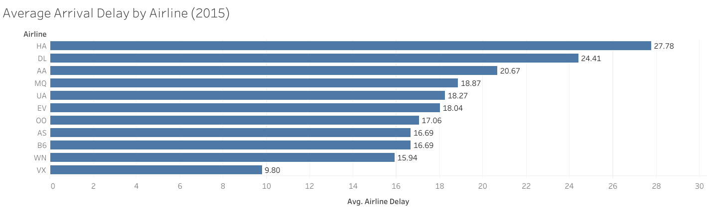
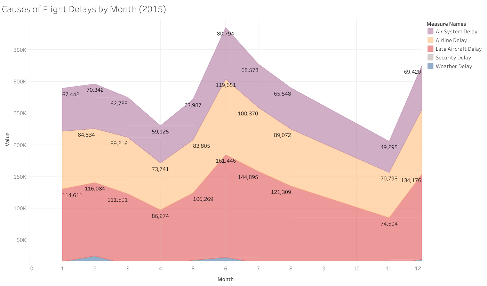
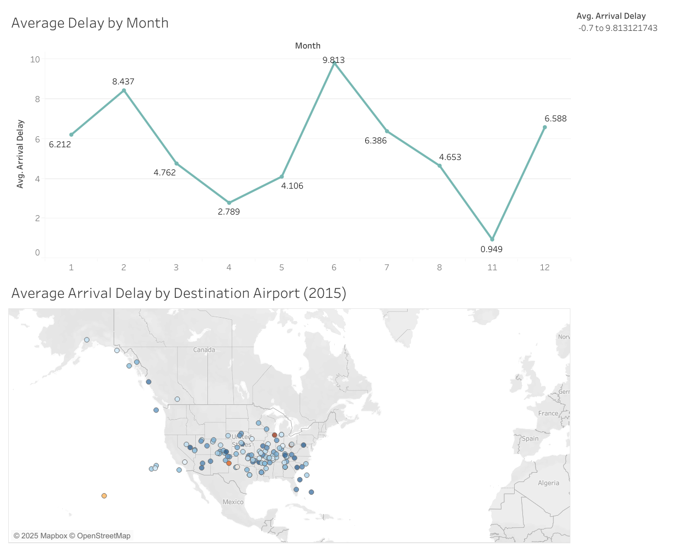

# ✈️ US Flight Delays (2015) – Data Visualization Project

## 📌 Overview
This project analyzes the **US Flight Delays dataset (2015)** using **Tableau**.  
The goal is to identify insights about:
- Which airlines experience the worst delays?
- What are the main causes of delays?
- How delays vary by time (month) and location (airports).

The final deliverables include **2 individual worksheets** and **1 interactive dashboard**.  
The project demonstrates the use of **data visualization design principles**, accessibility (color-blind friendly palettes), and interactivity (filters & tooltips).

---

## 🔗 Tableau Public Links
- [Bar Chart – Average Delay by Airline](https://public.tableau.com/app/profile/mohammad.abushams/viz/Book1_17563312212020/AverageArrivalDelaybyAirline2015?publish=yes)  
- [Area Chart – Causes of Flight Delays by Month](https://public.tableau.com/app/profile/mohammad.abushams/viz/Book1_17563312212020/CausesofFlightDelaysbyMonth2015?publish=yes)  
- [Dashboard – Delays by Month & Airport (https://public.tableau.com/app/profile/mohammad.abushams/viz/Book1_17563312212020/USAirlineDelaysTimeLocationInsights?publish=yes)  

---

## 📊 Visualizations

### 1. Average Delay by Airline (Bar Chart)
- **Finding:** Hawaiian Airlines (HA) had the highest average delay (~23 minutes), while Virgin America (VX) and Frontier Airlines (F9) had the lowest (~13–14 minutes).  
- **Design:** Single-colored bar chart to avoid double encoding. Length of bars alone encodes the value.  

---

### 2. Causes of Delays by Month (Stacked Area Chart)
- **Finding:** Late Aircraft was the leading cause of delays, peaking in June (161k minutes). Weather delays remained consistently low.  
- **Design:** Stacked area chart highlights seasonal peaks and patterns using distinct accessible colors.  

---

### 3. Dashboard – Delays by Month & Airport
- **Finding:**  
  - Delays peak in June–July and drop in September (Line Chart).  
  - Airports in the Northeast and West had worse delays compared to Central regions (Map).  
  - Airline filter allows focused analysis for individual carriers.  
- **Design:** Combined **Line Chart** and **Map** with a blue–orange diverging palette for colorblind accessibility. Filter ensures interactivity.  

---

## 🛠️ Tools & Skills
- **Tool:** Tableau Public  
- **Skills:** Data Visualization, Dashboard Design, Color Accessibility, Storytelling with Data  

---

## 📚 Resources
- Udacity Data Visualization Nanodegree (Project Guidelines)  
- [Kaggle – US Flight Delays 2015](https://www.kaggle.com/usdot/flight-delays)  
- Tableau Official Documentation  

---

## 👤 Author
**Mohammad Abushams**  
- 📧 1200549@student.birzeit.edu  
- 🌐 [LinkedIn](PUT-YOUR-LINKEDIN-HERE) | [GitHub](https://github.com/YOUR-USERNAME)  

